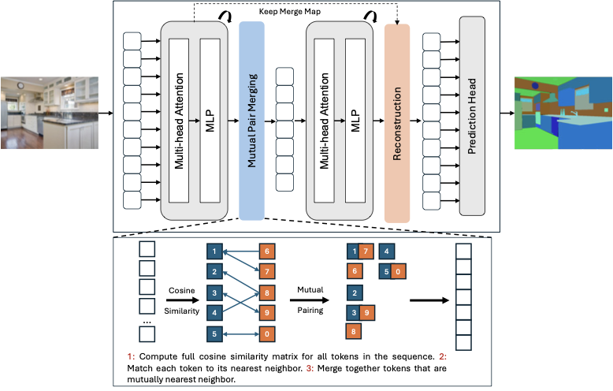

# MPM: Mutual Pair Merging for Efficient Vision Transformers 

[](https://arxiv.org/abs/2604.05718)

Official code for **MPM: Mutual Pair Merging for Efficient Vision Transformers** (CVPR 2026 Findings).

Simon Ravé, Pejman Rasti, David Rousseau  
LARIS, University of Angers; UMR INRAe-IRHS, Angers, France



MPM is a training-free token merging module for Vision Transformers. It forms mutual nearest-neighbor pairs in cosine space, averages each pair, keeps a merge map, and reconstructs the original token grid before dense prediction heads. It has no learned parameters and no continuous compression knob; the speed/accuracy trade-off is controlled by the insertion layers.

## Install

Using `uv`:

```bash
git clone git@github.com:saulane/MPM.git
cd MPM
uv sync
```

For Segmenter evaluation with the original mmsegmentation data pipeline, install the legacy dependencies:

```bash
uv sync
uv pip install --no-build-isolation -r requirements-segmenter.txt
```

`mmcv==1.3.8` has an undeclared build-time dependency on `setuptools`, so run `uv sync` first; the base MPM environment installs it before the non-isolated mmcv build.

`pip` also works but please use [uv](https://docs.astral.sh/uv/getting-started/installation/) for your own sanity :

```bash
pip install -e .
```

For Segmenter evaluation with `pip`, install the legacy requirements:

```bash
pip install -r requirements-segmenter.txt
```

## Use MPM With timm

For a quick speedtest run `quick_test_mpm.py`.

```python
import timm
import torch
from mpm import apply_patch

model = timm.create_model("vit_base_patch16_384", pretrained=True).eval()
apply_patch(model, mpm_layers=(2, 5))

x = torch.randn(1, 3, 384, 384)
with torch.inference_mode():
    y = model(x)
```

`mpm_layers` uses 0-based block indices. The paper default is `(2, 5)`, meaning MPM is inserted before the 3rd and 6th encoder blocks.

## Segmenter Models

This repository includes a minimal Segmenter fork for reproducing the paper setup. Download the official pretrained Segmenter checkpoints, then enable MPM at inference time:

```bash
uv run mpm-download-segmenter-model ade20k-seg-t-mask --output-dir checkpoints
uv run python -m segm.inference \
  --model-path checkpoints/ade20k-seg-t-mask/checkpoint.pth \
  --input-dir images \
  --output-dir outputs \
  --mpm-layers 2,5
```

Available downloader names:

```text
ade20k-seg-t-mask
ade20k-seg-s-mask
ade20k-seg-b-mask
ade20k-seg-l-mask
cityscapes-seg-l-mask
pcontext-seg-l-mask
```

For ADE20K evaluation:

```bash
export DATASET=/path/to/datasets
uv run python -m segm.scripts.prepare_ade20k "$DATASET"
uv run python -m segm.eval.miou \
  checkpoints/ade20k-seg-t-mask/checkpoint.pth \
  ade20k \
  --singlescale \
  --mpm-layers 2,5
```

The checkpoints are downloaded from the original [Segmenter model zoo](https://github.com/rstrudel/segmenter#model-zoo). Put each downloaded `checkpoint.pth` and `variant.yml` in the same directory.

## Project Origin

MPM is built on [Segmenter: Transformer for Semantic Segmentation](https://arxiv.org/abs/2105.05633) and its [official repository](https://github.com/rstrudel/segmenter). The Segmenter-derived code is kept only to load pretrained Segmenter checkpoints and run inference/evaluation with MPM.

## Acknowledgements

This research was funded by the European Union's Horizon Europe Research and Innovation Programme under the PHENET project, Grant Agreement No. 101094587. This work was granted access to the HPC resources of IDRIS under the allocation 2024-AD010115553 made by GENCI.

## Citation

```bibtex
@inproceedings{rave2026mpm,
  title={MPM: Mutual Pair Merging for Efficient Vision Transformers},
  author={Rav{\'e}, Simon and Rasti, Pejman and Rousseau, David},
  booktitle={IEEE/CVF Conference on Computer Vision and Pattern Recognition- FINDINGS Track (CVPRF)},
  year={2026}
}
```
